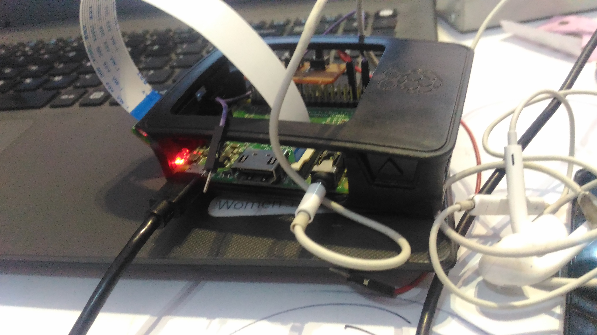

# AIcaption
Image Captioning is the technique in which automatic descriptions are generated for an image
We have used Flickr8k dataset.
MS-COCO and Flickr30K are other datasets that you can use.
Flickr8K has 6000 training images, 1000 validation images and 1000 testing images. Each image has 5 captions describing it.

Image Caption Generator: Image caption generation is the problem of generating a
descriptive sentence of an image. The fact that humans can do this with remarkable ease
makes this a very interesting and challenging problem for Artificial Intelligence system,
combining aspects of computer vision (in particular scene understanding) and natural
language processing

Helping blind people using various technologies is not a new idea. There have been
tremendous efforts by lots of people to develop a system that can help visually impaired people
understand their surroundings. Very close to our system is the system which identifies the
objects in an image. But we did not find any system using caption generation and visual
question answering technologies

Our system features a pipeline that consists of a hardware interface which can be
directly controlled by user, camera, processing unit (i.e Raspberry Pi), and functionalities of
this system is powered by multiple state-of-the-art Deep Learning models. When user wants
to use any functionality, he or she needs to click a button which will command the main system
to capture an image. Then, this image will be sent to our image captioning algorithm which
will generate a caption for this image. A speech of this caption will be generated by using a
speech synthesizer

Third eye is an assistant for visually impaired which narrates the description of the scene. Functionalities provided by our system are Image caption generation, OCR.

Technology We used For Image caption:

Keras/TensorFlow
CNN + LSTM

Test Cases
Case 1: Getting an image using in-built camera
Purpose: ThirdEye needs an image to generate a caption. This device comes with an
 in-built camera that captures an image. Ideally, when user presses a button to capture
 an image, the camera should capture an image and pass it to caption generator module.

Case 2: Generating a caption
Purpose: When an image is forwarded to caption generator module, the module
 should accept the image and generate a relevant caption for that image. In the worst
 case, the module will generate an irrelevant caption but it won’t fail to generate
 caption unless it’s a hardware problem.
 Case 3: Converting text into a speech
 Purpose: When the caption is forwarded to text to speech module, the module
  should accept the caption and generate a relevant speech for that caption. In the worst
  case, the module will generate an irrelevant speech but it won’t fail to generate
  caption unless it’s a hardware problem.
Case 4: Sending speech to user

Product: -

